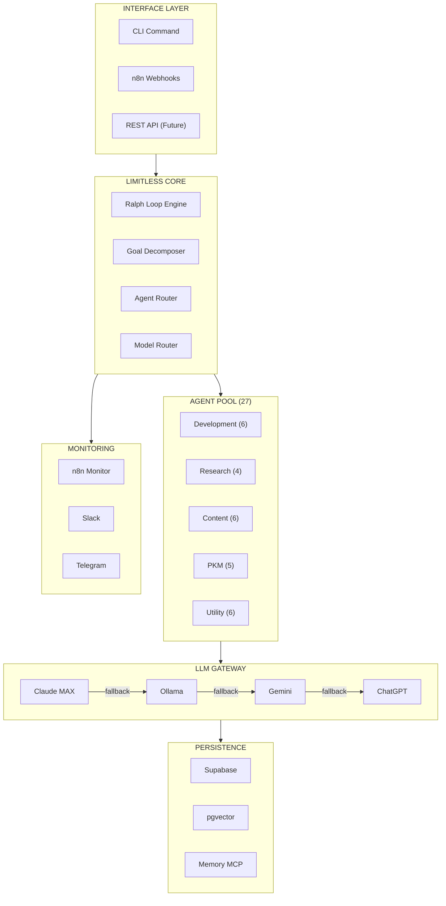
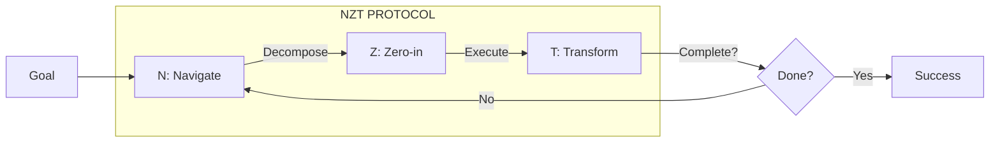
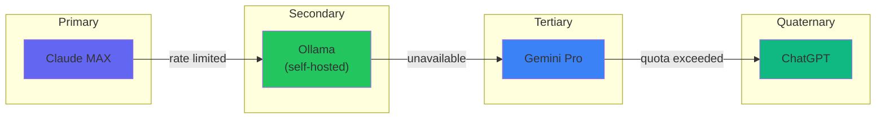
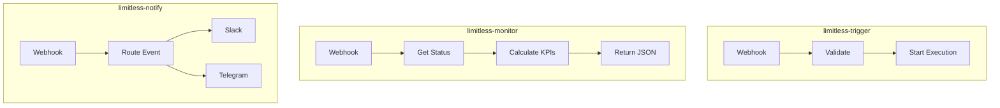
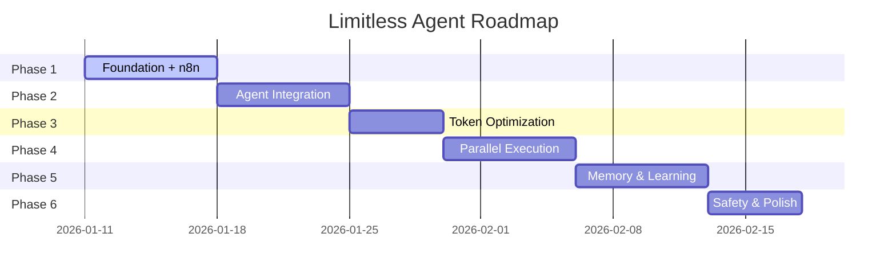

# Limitless Agent

<div align="center">

```
 ██╗     ██╗███╗   ███╗██╗████████╗██╗     ███████╗███████╗███████╗
 ██║     ██║████╗ ████║██║╚══██╔══╝██║     ██╔════╝██╔════╝██╔════╝
 ██║     ██║██╔████╔██║██║   ██║   ██║     █████╗  ███████╗███████╗
 ██║     ██║██║╚██╔╝██║██║   ██║   ██║     ██╔══╝  ╚════██║╚════██║
 ███████╗██║██║ ╚═╝ ██║██║   ██║   ███████╗███████╗███████║███████║
 ╚══════╝╚═╝╚═╝     ╚═╝╚═╝   ╚═╝   ╚══════╝╚══════╝╚══════╝╚══════╝
```

**"What if you could access 100% of your brain?"**

*Inspired by the film Limitless (2011) and the NZT-48 pill*

[](CHANGELOG.md)
[](LICENSE)
[]()
[](https://supabase.com)

</div>

---

## Real Life OS Integration

LimitlessAgent is now integrated into the **Real Life OS** architecture as a domain (`limitless_`):

| Resource | Value |
|----------|-------|
| **Supabase Project** | intentum |
| **Tables** | 6 (limitless_*) |
| **RLS** | 100% enabled |
| **Status** | Ready v2.0.0 |

```sql
-- Tables deployed
limitless_executions    -- Agent runs/goals
limitless_tasks         -- Subtasks per execution
limitless_memory        -- Persistent memory
limitless_documents     -- RAG vector store
limitless_agent_runs    -- Performance tracking
limitless_metrics       -- Aggregated metrics
```

See [CHANGELOG.md](CHANGELOG.md) for security migrations and v2.0.0 details.

---

## Overview

**Limitless Agent** is an autonomous AI system that unlocks the full potential of the claude-code ecosystem:

- **27 Specialized Agents** - Your army of experts
- **27 Skills** - Instant capabilities
- **14 MCPs** - External integrations
- **Multi-LLM Fallback** - Never hit a wall

Like NZT-48, Limitless Agent removes the barriers between you and accomplishment.

> *"I wasn't high. I wasn't wired. Just clear. I knew what I needed to do and how to do it."*
> — Eddie Morra, Limitless

---

## Architecture



---

## The NZT Protocol

Just like NZT-48 enhances cognitive function, the Limitless Agent follows the **NZT Protocol**:



| Phase | Action | Component |
|-------|--------|-----------|
| **N**avigate | Understand and decompose the goal | Goal Decomposer |
| **Z**ero-in | Select optimal agents and models | Agent/Model Router |
| **T**ransform | Execute and iterate until complete | Ralph Loop Engine |

---

## Project Structure

```
LimitlessAgent/
├── README.md                              # You are here
├── LICENSE                                # MIT License
├── .gitignore                             # Git ignore rules
│
├── docs/                                  # Documentation
│   ├── SPECIFICATION.md                   # Technical spec (PRD/RFC)
│   ├── ARCHITECTURE.md                    # Architecture reference
│   ├── QUICKSTART.md                      # Getting started guide
│   ├── API.md                             # API reference
│   ├── diagrams/                          # Visual diagrams
│   │   ├── architecture.md                # Mermaid diagrams
│   │   ├── data-flow.md                   # Data flow diagrams
│   │   └── llm-routing.md                 # LLM routing logic
│   └── examples/                          # Usage examples
│       ├── simple-goal.md
│       ├── complex-goal.md
│       └── parallel-execution.md
│
├── config/                                # Configuration
│   ├── settings.json                      # Main configuration
│   ├── ollama.json                        # Ollama models
│   ├── notifications.json                 # Slack/Telegram
│   └── limits.json                        # Safety limits
│
├── n8n/                                   # n8n Workflows
│   └── workflows/
│       ├── limitless-monitor.json         # Monitoring workflow
│       ├── limitless-notify.json          # Notification workflow
│       └── limitless-trigger.json         # External trigger
│
├── sql/                                   # Database
│   ├── schema.sql                         # Main schema
│   ├── migrations/                        # Schema migrations
│   └── seeds/                             # Initial data
│
├── scripts/                               # Executables
│   ├── limitless.sh                       # Main entry point
│   ├── install.sh                         # Installation script
│   └── health-check.sh                    # Health verification
│
├── src/                                   # Source code
│   ├── core/                              # Core engine
│   │   ├── ralph-loop.js                  # Main loop
│   │   ├── goal-decomposer.js             # Goal analysis
│   │   └── completion-checker.js          # Success detection
│   ├── routing/                           # Routing logic
│   │   ├── agent-router.js                # Agent selection
│   │   ├── model-router.js                # LLM selection
│   │   └── fallback-chain.js              # Fallback handling
│   ├── integrations/                      # External integrations
│   │   ├── supabase.js                    # Database client
│   │   ├── ollama.js                      # Ollama client
│   │   └── notifications.js               # Slack/Telegram
│   └── utils/                             # Utilities
│       ├── logger.js                      # Logging
│       ├── metrics.js                     # Metrics collection
│       └── token-counter.js               # Token estimation
│
├── tests/                                 # Tests
│   ├── unit/                              # Unit tests
│   ├── integration/                       # Integration tests
│   └── e2e/                               # End-to-end tests
│
└── logs/                                  # Execution logs
    └── .gitkeep
```

---

## Technology Stack

| Component | Technology | Purpose |
|-----------|------------|---------|
| **Primary LLM** | Claude MAX | Main reasoning engine |
| **Fallback LLMs** | Ollama, Gemini, ChatGPT | Multi-provider resilience |
| **Database** | Supabase (PostgreSQL + pgvector) | State & vector storage |
| **Orchestration** | n8n | Visual workflow automation |
| **Notifications** | Slack, Telegram | Real-time alerts |
| **Core Pattern** | Ralph Loop | Autonomous iteration |

### Ollama Models

| Model | Parameters | Use Case | Priority |
|-------|------------|----------|----------|
| `llama3.2:3b` | 3B | Quick tasks, validation | 1 (fastest) |
| `codellama:13b` | 13B | Code generation/review | 2 (code) |
| `mistral:7b` | 7B | General reasoning | 3 (fallback) |

### LLM Fallback Chain



**Cost**: $0 additional (all services already available)

---

## Quick Start

### Prerequisites

- Claude Code CLI installed
- Supabase account (free tier works)
- n8n instance (self-hosted or cloud)
- Ollama running (optional but recommended)

### Installation

```bash
# Clone the repository
git clone https://github.com/matheusallvarenga/limitless-agent.git
cd limitless-agent

# Run installation script
./scripts/install.sh

# Or manual setup:

# 1. Execute SQL schema in Supabase
psql $DATABASE_URL -f sql/schema.sql

# 2. Import n8n workflows
# Upload n8n/workflows/*.json to your n8n instance

# 3. Configure environment
cp config/settings.example.json config/settings.json
# Edit with your credentials

# 4. Make script executable
chmod +x scripts/limitless.sh
```

### Usage

```bash
# Basic usage
./scripts/limitless.sh "Create a REST API with authentication"

# With options
./scripts/limitless.sh run "Build a landing page" --max-iterations 10

# Check status
./scripts/limitless.sh status

# Health check
./scripts/limitless.sh health

# View help
./scripts/limitless.sh help
```

---

## n8n Integration

### Webhooks

| Endpoint | Purpose |
|----------|---------|
| `POST /webhook/limitless-monitor` | Query execution status, KPIs |
| `POST /webhook/limitless-notify` | Receive notifications |
| `POST /webhook/limitless-trigger` | Trigger new executions |

### Workflows



---

## Roadmap



| Phase | Focus | Status |
|-------|-------|--------|
| **Phase 1** | Foundation + n8n | ✅ Complete |
| **Phase 1.5** | Database Security + Real Life OS | ✅ Complete |
| **Phase 2** | Agent Integration | In Progress |
| **Phase 3** | Token Optimization | Pending |
| **Phase 4** | Parallel Execution | Pending |
| **Phase 5** | Memory & Learning | Pending |
| **Phase 6** | Safety & Polish | Pending |

---

## Documentation

- [Technical Specification](docs/SPECIFICATION.md) - Complete PRD/RFC
- [Architecture Reference](docs/ARCHITECTURE.md) - System design
- [Quick Start Guide](docs/QUICKSTART.md) - Get running fast
- [API Reference](docs/API.md) - Endpoints and schemas
- [Examples](docs/examples/) - Usage examples

---

## Contributing

Contributions are welcome! Please read our contributing guidelines before submitting PRs.

---

## License

MIT License - see [LICENSE](LICENSE) for details.

---

## Acknowledgments

- **Limitless (2011)** - For the inspiration
- **Geoffrey Huntley** - For the Ralph Loop pattern
- **Anthropic** - For Claude and the Agent SDK
- **The AI Community** - For countless open-source contributions

---

<div align="center">

**"I see everything. I understand everything."**

*— Eddie Morra*

---

Made with NZT-48 by [Matheus Allvarenga](https://github.com/matheusallvarenga)

</div>
