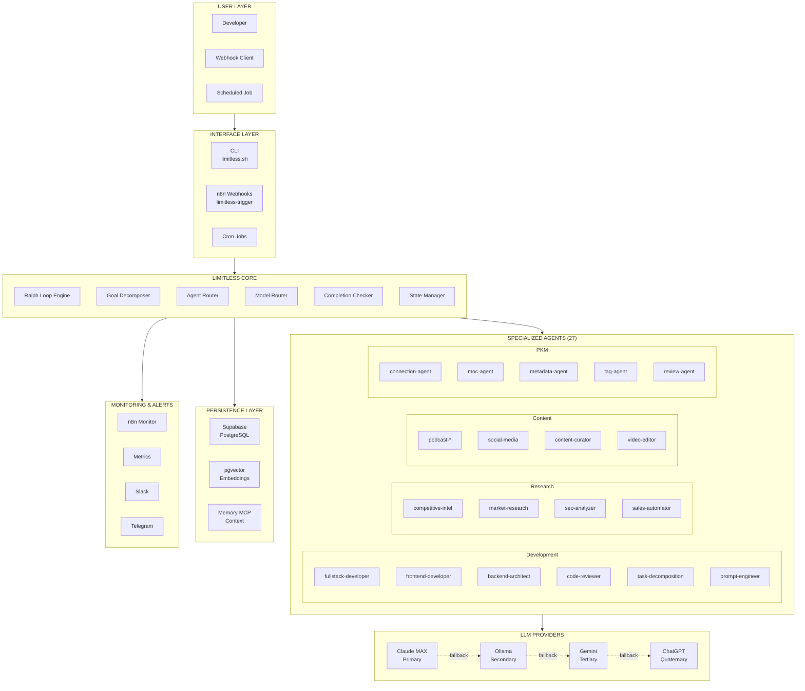
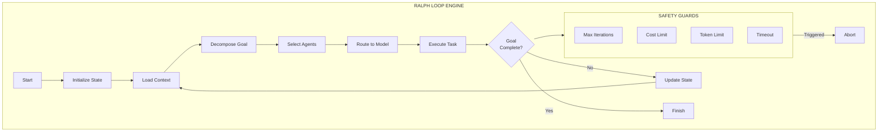
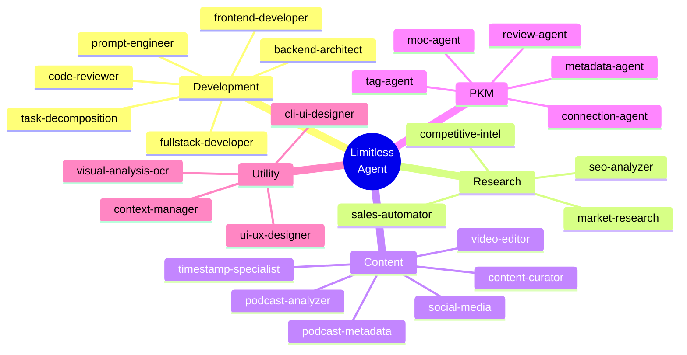
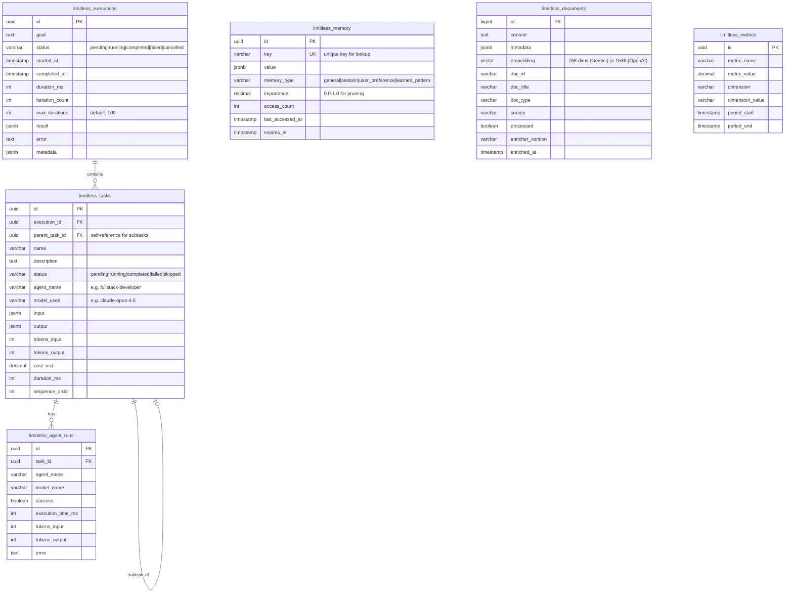
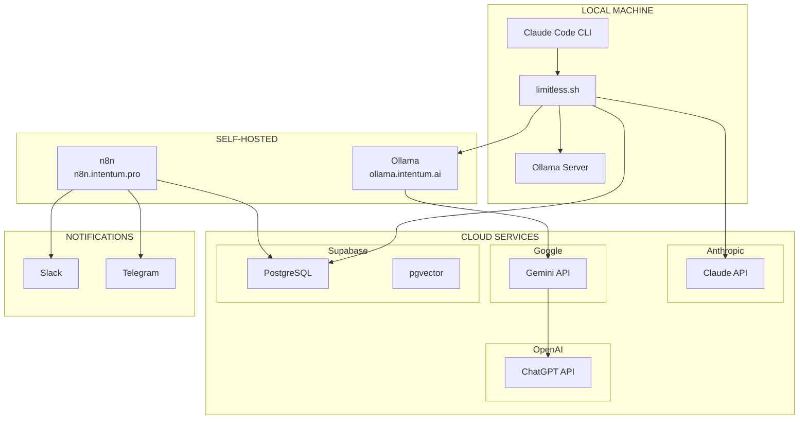
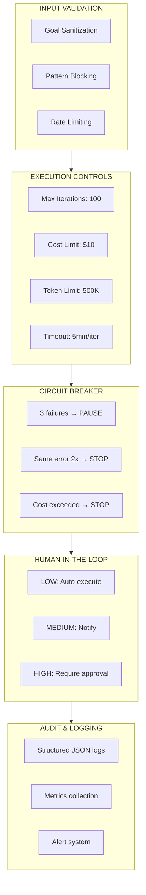
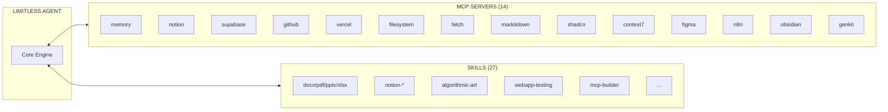

# Limitless Agent - Architecture Diagrams

This document contains all architecture diagrams for the Limitless Agent system.

---

## System Overview

---

## Core Engine Detail

---

## Agent Categories

---

## Database Schema

---

## Deployment Architecture

---

## Security Architecture

---

## Integration Points

