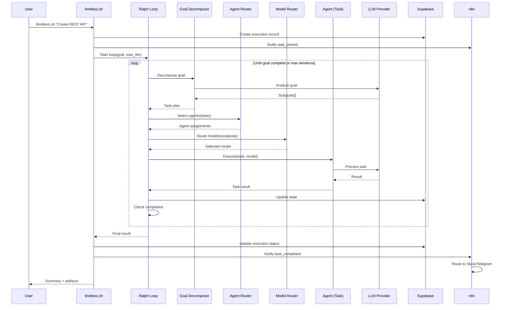
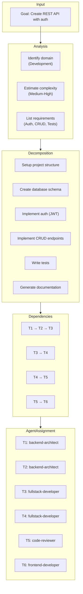
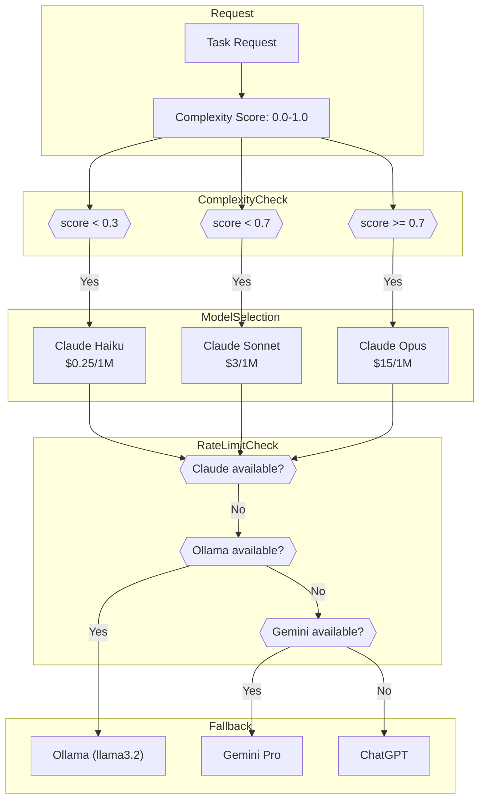
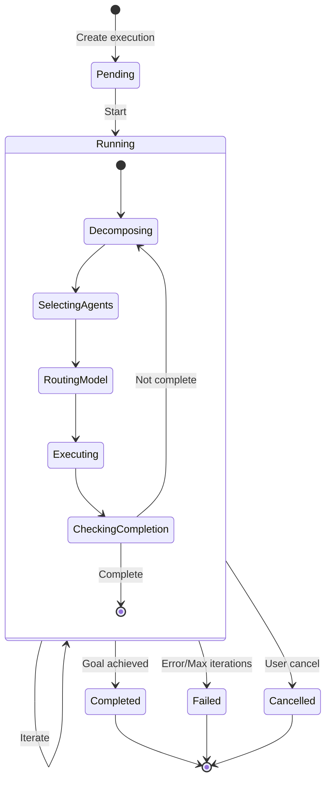
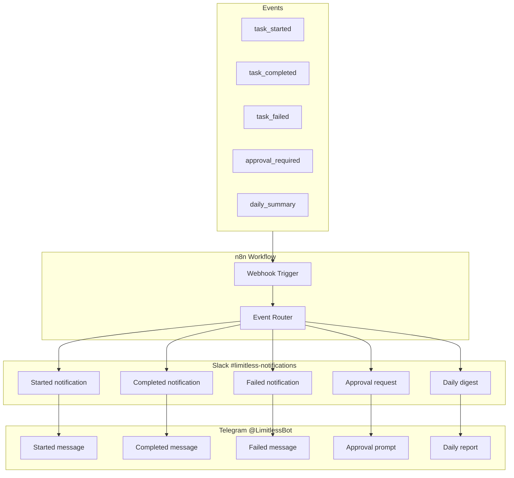
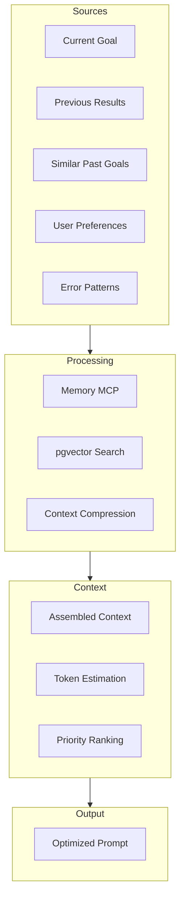
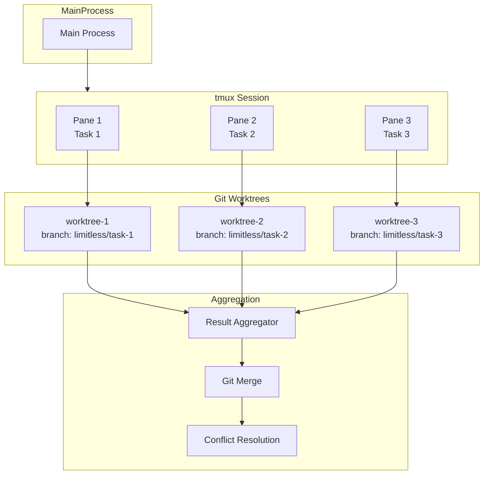
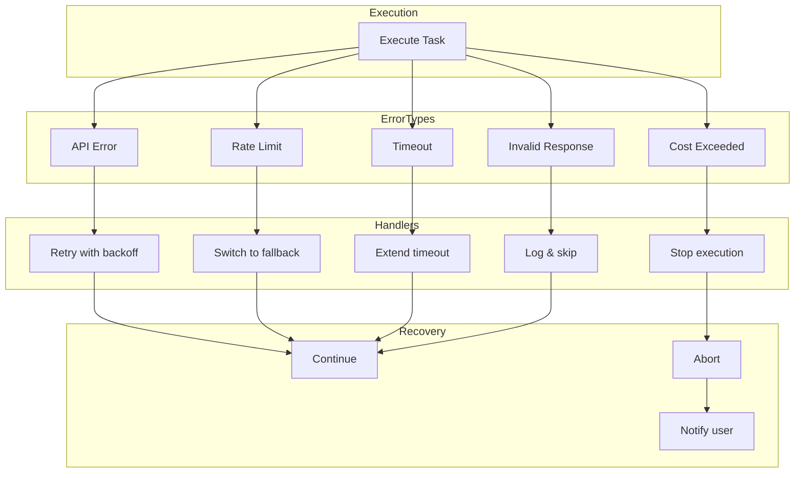

# Limitless Agent - Data Flow Diagrams

This document details all data flows in the Limitless Agent system.

---

## Main Execution Flow

---

## Goal Decomposition Flow

---

## LLM Routing Flow

---

## State Management Flow

---

## Notification Flow

---

## Memory & Context Flow

---

## Parallel Execution Flow (Future)

---

## Error Handling Flow

