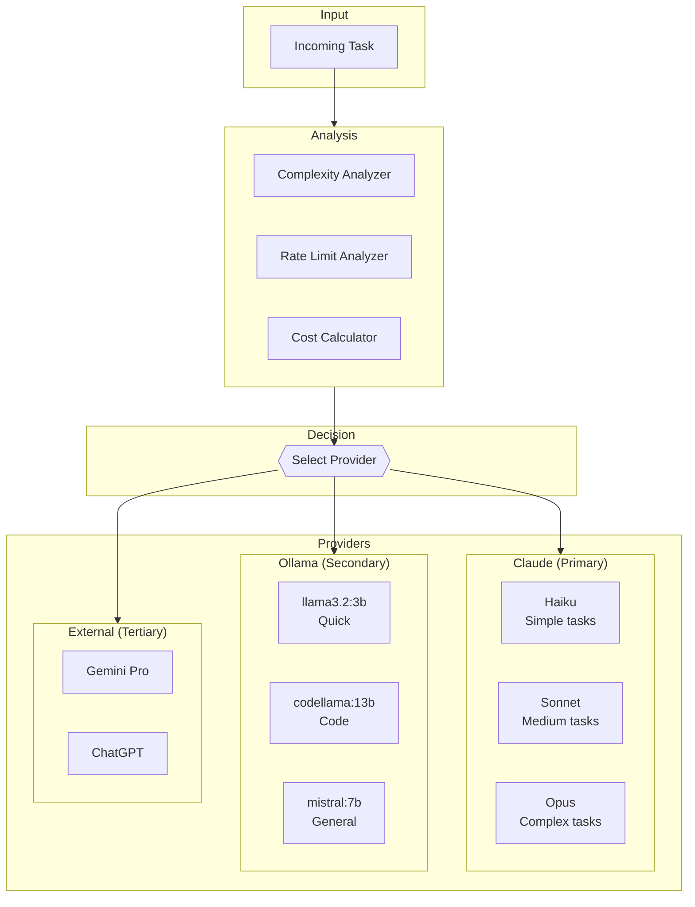
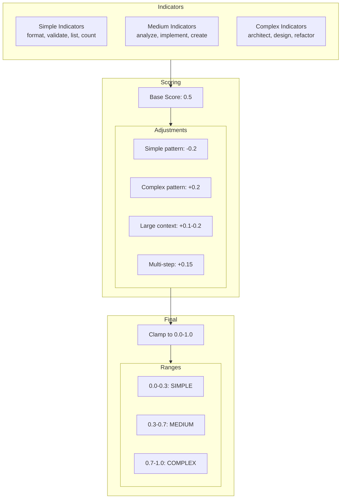
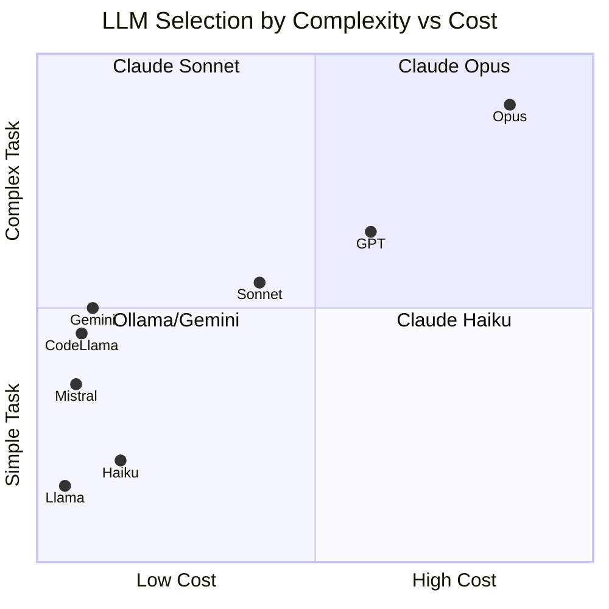
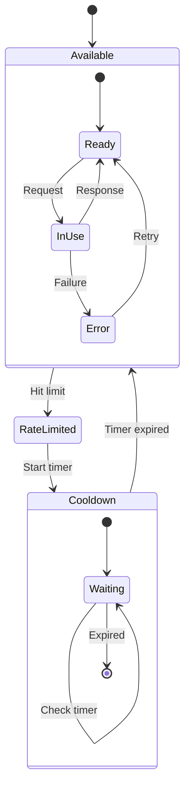
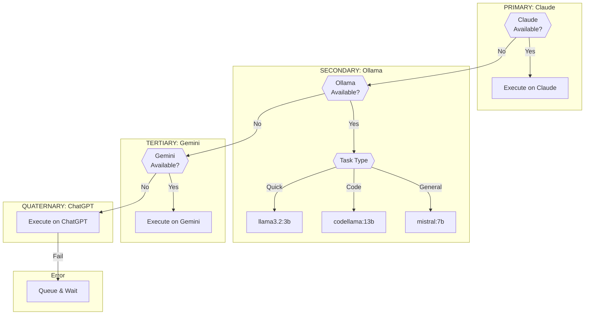
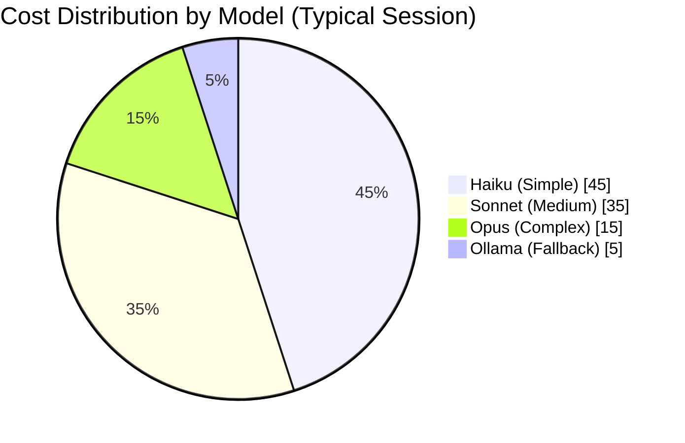
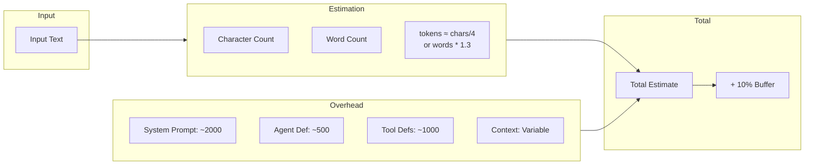
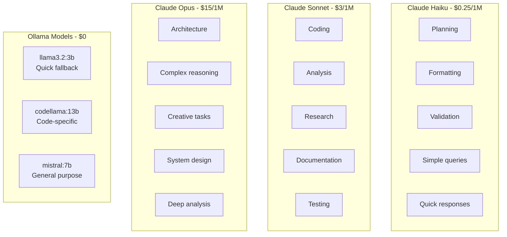
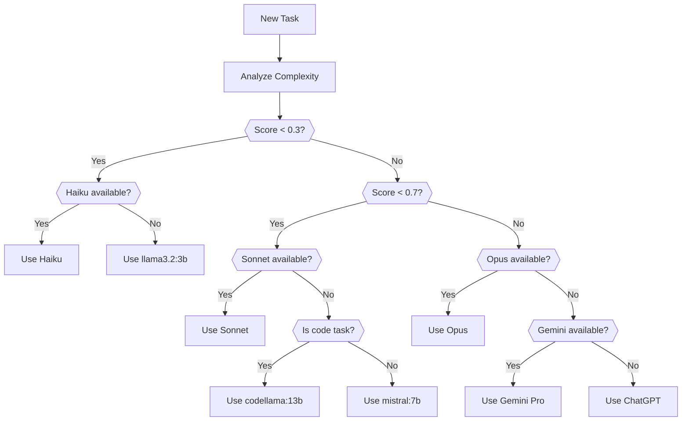

# Limitless Agent - LLM Routing Diagrams

This document details the intelligent LLM routing system.

---

## Overview



---

## Complexity Scoring Algorithm



---

## Provider Selection Matrix



---

## Rate Limit Handling



---

## Fallback Chain Logic



---

## Cost Optimization



### Cost Comparison

```mermaid
xychart-beta
    title "Cost per 1M Tokens (Input/Output)"
    x-axis ["Haiku", "Sonnet", "Opus", "Gemini", "GPT-4"]
    y-axis "USD" 0 --> 80
    bar [0.25, 3, 15, 1.25, 10]
    bar [1.25, 15, 75, 5, 30]
```



---

## Token Estimation



---

## Model Capabilities



---

## Response Time Expectations

```mermaid
gantt
    title Average Response Time by Model
    dateFormat X
    axisFormat %s

    section Claude
    Haiku (simple)     :0, 2
    Sonnet (medium)    :0, 5
    Opus (complex)     :0, 15

    section Ollama
    llama3.2:3b        :0, 3
    codellama:13b      :0, 8
    mistral:7b         :0, 6

    section External
    Gemini Pro         :0, 4
    ChatGPT            :0, 6
```

---

## Routing Decision Tree


