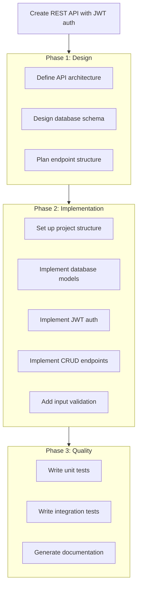

# Example: Complex Goal

This example demonstrates using Limitless Agent for a multi-step, complex task.

---

## Goal

```
Create a complete REST API for user management with JWT authentication, including database schema, endpoints for CRUD operations, input validation, and comprehensive tests
```

## Command

```bash
./scripts/limitless.sh run "Create a complete REST API for user management with JWT authentication, including database schema, endpoints for CRUD operations, input validation, and comprehensive tests" --max-iterations 20
```

---

## Execution Flow

### 1. Goal Analysis

Limitless Agent analyzes the goal:

```
Complexity Score: 0.85 (COMPLEX)
Estimated Iterations: 5-8
Recommended Model: Claude Opus (architecture), Claude Sonnet (implementation)
Agents Needed:
  - backend-architect (design)
  - fullstack-developer (implementation)
  - code-reviewer (testing)
```

### 2. Goal Decomposition



### 3. Iterations

#### Iteration 1: Architecture Design
- **Agent**: backend-architect
- **Model**: Claude Opus
- **Output**: API design document, endpoint specifications

#### Iteration 2: Database Schema
- **Agent**: backend-architect
- **Model**: Claude Sonnet
- **Output**: SQL schema with users, sessions tables

```sql
CREATE TABLE users (
    id UUID PRIMARY KEY DEFAULT gen_random_uuid(),
    email VARCHAR(255) UNIQUE NOT NULL,
    password_hash VARCHAR(255) NOT NULL,
    name VARCHAR(255),
    created_at TIMESTAMP DEFAULT NOW(),
    updated_at TIMESTAMP DEFAULT NOW()
);

CREATE TABLE sessions (
    id UUID PRIMARY KEY DEFAULT gen_random_uuid(),
    user_id UUID REFERENCES users(id),
    token VARCHAR(500) NOT NULL,
    expires_at TIMESTAMP NOT NULL,
    created_at TIMESTAMP DEFAULT NOW()
);
```

#### Iteration 3: Project Setup
- **Agent**: fullstack-developer
- **Model**: Claude Sonnet
- **Output**: Project structure, package.json, dependencies

```
api/
├── src/
│   ├── controllers/
│   ├── middleware/
│   ├── models/
│   ├── routes/
│   ├── utils/
│   └── index.js
├── tests/
├── package.json
└── README.md
```

#### Iteration 4: JWT Authentication
- **Agent**: fullstack-developer
- **Model**: Claude Sonnet
- **Output**: Auth middleware, login/register endpoints

```javascript
// middleware/auth.js
const jwt = require('jsonwebtoken');

const authenticate = (req, res, next) => {
    const token = req.headers.authorization?.split(' ')[1];
    if (!token) return res.status(401).json({ error: 'No token provided' });

    try {
        const decoded = jwt.verify(token, process.env.JWT_SECRET);
        req.user = decoded;
        next();
    } catch (err) {
        res.status(401).json({ error: 'Invalid token' });
    }
};
```

#### Iteration 5: CRUD Endpoints
- **Agent**: fullstack-developer
- **Model**: Claude Sonnet
- **Output**: User CRUD operations

#### Iteration 6: Input Validation
- **Agent**: fullstack-developer
- **Model**: Claude Haiku
- **Output**: Validation middleware with Joi

#### Iteration 7: Unit Tests
- **Agent**: code-reviewer
- **Model**: Claude Sonnet
- **Output**: Jest test suite

```javascript
describe('User API', () => {
    test('POST /users should create user', async () => {
        const res = await request(app)
            .post('/users')
            .send({ email: 'test@example.com', password: 'secure123' });
        expect(res.status).toBe(201);
        expect(res.body.user.email).toBe('test@example.com');
    });
});
```

#### Iteration 8: Integration Tests & Documentation
- **Agent**: code-reviewer
- **Model**: Claude Haiku
- **Output**: Integration tests, API documentation

### 4. Completion Check

All subtasks completed. Goal achieved in 8 iterations.

---

## Output Summary

```
[INFO] Starting Limitless execution
[INFO] Execution ID: b2c3d4e5-f6a7-8901-bcde-f23456789012
[INFO] Goal: Create a complete REST API...
[INFO] Max Iterations: 20

[INFO] Iteration 1/20 - Architecture Design (backend-architect, Opus)
[INFO] Iteration 2/20 - Database Schema (backend-architect, Sonnet)
[INFO] Iteration 3/20 - Project Setup (fullstack-developer, Sonnet)
[INFO] Iteration 4/20 - JWT Authentication (fullstack-developer, Sonnet)
[INFO] Iteration 5/20 - CRUD Endpoints (fullstack-developer, Sonnet)
[INFO] Iteration 6/20 - Input Validation (fullstack-developer, Haiku)
[INFO] Iteration 7/20 - Unit Tests (code-reviewer, Sonnet)
[INFO] Iteration 8/20 - Integration Tests & Docs (code-reviewer, Haiku)

[SUCCESS] Goal completed at iteration 8

## Artifacts Created

- `api/src/` - Source code (12 files)
- `api/tests/` - Test suite (8 files)
- `api/docs/` - API documentation
- `api/sql/schema.sql` - Database schema

## Metrics

- Duration: 4m 32s
- Iterations: 8
- Agents used: 3 (backend-architect, fullstack-developer, code-reviewer)
- Models used: Opus (1), Sonnet (5), Haiku (2)
- Tokens: 45,234
- Cost: $0.38

## Test Results

- Unit tests: 24 passed
- Integration tests: 12 passed
- Coverage: 92%
```

---

## Cost Breakdown

| Iteration | Model | Tokens | Cost |
|-----------|-------|--------|------|
| 1 | Opus | 8,500 | $0.13 |
| 2 | Sonnet | 6,200 | $0.05 |
| 3 | Sonnet | 5,800 | $0.05 |
| 4 | Sonnet | 7,100 | $0.06 |
| 5 | Sonnet | 6,500 | $0.05 |
| 6 | Haiku | 2,100 | $0.003 |
| 7 | Sonnet | 5,800 | $0.05 |
| 8 | Haiku | 3,234 | $0.004 |
| **Total** | | **45,234** | **$0.38** |

---

## Key Takeaways

1. **Complex goals** automatically decompose into subtasks
2. **Multiple agents** collaborate based on expertise
3. **Model routing** optimizes cost (Opus for design, Haiku for simple tasks)
4. **Iterative refinement** ensures quality
5. **Comprehensive output** includes code, tests, and documentation

---

## Try It Yourself

```bash
./scripts/limitless.sh run "Create a complete REST API for user management with JWT authentication, including database schema, endpoints for CRUD operations, input validation, and comprehensive tests"
```
