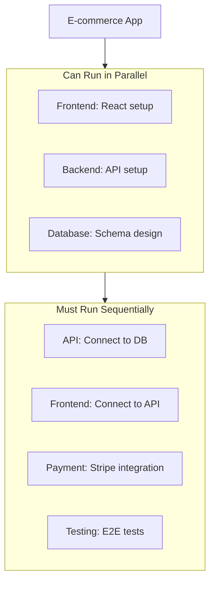

# Example: Parallel Execution (Future Feature)

This example demonstrates the planned parallel execution feature using tmux and git worktrees.

> **Note**: This feature is planned for Phase 4. This document shows the expected behavior.

---

## Goal

```
Build a full-stack e-commerce application with:
1. React frontend with product catalog
2. Node.js backend API
3. PostgreSQL database
4. Payment integration (Stripe)
```

## Command

```bash
./scripts/limitless.sh run "Build a full-stack e-commerce application..." --parallel
```

---

## Parallel Execution Strategy

### Task Analysis



### Worktree Setup

```bash
# Main branch
git checkout main

# Create worktrees for parallel work
git worktree add /tmp/limitless/frontend limitless/frontend
git worktree add /tmp/limitless/backend limitless/backend
git worktree add /tmp/limitless/database limitless/database
```

### tmux Session

```
┌─────────────────────────────────────────────────────────────┐
│ Limitless Agent - Parallel Execution                        │
├─────────────────┬───────────────────┬───────────────────────┤
│ Pane 0: Frontend│ Pane 1: Backend   │ Pane 2: Database      │
│                 │                   │                       │
│ Agent: frontend │ Agent: backend    │ Agent: backend        │
│ Model: Sonnet   │ Model: Sonnet     │ Model: Sonnet         │
│                 │                   │                       │
│ Status: Running │ Status: Running   │ Status: Running       │
│ Progress: 45%   │ Progress: 60%     │ Progress: 80%         │
│                 │                   │                       │
│ > Creating      │ > Setting up      │ > Creating tables     │
│   components... │   Express app...  │   and indexes...      │
├─────────────────┴───────────────────┴───────────────────────┤
│ Main: Orchestrator - Monitoring 3 parallel tasks            │
└─────────────────────────────────────────────────────────────┘
```

---

## Execution Flow

### Phase 1: Parallel Setup (Iterations 1-3)

Three agents work simultaneously:

```
[PARALLEL] Starting 3 concurrent tasks...

[Pane 0] frontend-developer: Setting up React with Vite
[Pane 1] backend-architect: Setting up Express.js API
[Pane 2] backend-architect: Designing PostgreSQL schema

[PARALLEL] All tasks completed in 2m 15s (vs 6m 45s sequential)
Speedup: 3x
```

### Phase 2: Integration (Iterations 4-5)

Sequential integration after parallel work:

```
[SEQUENTIAL] Integrating components...

[Iter 4] Connecting backend to database
[Iter 5] Connecting frontend to API
```

### Phase 3: Features (Iteration 6)

```
[SEQUENTIAL] Adding Stripe payment integration...
```

### Phase 4: Testing (Iteration 7)

```
[SEQUENTIAL] Running E2E tests...
```

---

## Merge Strategy

### Automatic Merge (No Conflicts)

```bash
# After parallel work completes
git checkout main

# Merge each worktree
git merge limitless/frontend --no-ff -m "feat: React frontend"
git merge limitless/backend --no-ff -m "feat: Express API"
git merge limitless/database --no-ff -m "feat: PostgreSQL schema"

# Cleanup
git worktree remove /tmp/limitless/frontend
git worktree remove /tmp/limitless/backend
git worktree remove /tmp/limitless/database
```

### Conflict Resolution

If conflicts occur:

1. **Automatic**: Use LLM to resolve simple conflicts
2. **Manual**: Flag for human review if complex

```
[CONFLICT] Detected merge conflict in package.json
[RESOLVE] Attempting automatic resolution...
[SUCCESS] Conflict resolved: Combined dependencies from both branches
```

---

## Performance Comparison

### Sequential Execution

```
Task 1 (Frontend): 2m 15s
Task 2 (Backend):  2m 30s
Task 3 (Database): 2m 00s
Task 4 (Connect):  1m 30s
Task 5 (API):      1m 15s
Task 6 (Stripe):   2m 00s
Task 7 (Tests):    3m 00s
─────────────────────────
Total: 14m 30s
```

### Parallel Execution

```
Tasks 1-3 (Parallel): 2m 30s (longest)
Task 4 (Connect):     1m 30s
Task 5 (API):         1m 15s
Task 6 (Stripe):      2m 00s
Task 7 (Tests):       3m 00s
─────────────────────────
Total: 10m 15s
Speedup: 1.4x
```

### Highly Parallelizable Goal

For goals with more independent tasks:

```
Sequential: 30m
Parallel:   10m (with 3 workers)
Speedup:    3x
```

---

## Configuration

### Enable Parallel Mode

```json
// config/settings.json
{
  "parallel": {
    "enabled": true,
    "max_workers": 3,
    "worktree_path": "/tmp/limitless",
    "merge_strategy": "auto"
  }
}
```

### Command Line

```bash
# Enable parallel mode
./scripts/limitless.sh run "goal" --parallel

# Set max workers
./scripts/limitless.sh run "goal" --parallel --workers 5

# Disable auto-merge (manual review)
./scripts/limitless.sh run "goal" --parallel --no-auto-merge
```

---

## Limitations

1. **Not all tasks parallelize**: Some tasks have dependencies
2. **Resource usage**: More CPU/memory when running parallel
3. **Merge conflicts**: May require manual resolution
4. **LLM rate limits**: Multiple parallel calls may hit limits faster

---

## When to Use Parallel

| Scenario | Recommendation |
|----------|----------------|
| Frontend + Backend + DB | Parallel |
| Sequential API endpoints | Sequential |
| Independent microservices | Parallel |
| Refactoring single file | Sequential |
| Multi-repo changes | Parallel |

---

## Roadmap

- [ ] Phase 4.1: Basic tmux orchestration
- [ ] Phase 4.2: Git worktree isolation
- [ ] Phase 4.3: Automatic merge
- [ ] Phase 4.4: Conflict resolution
- [ ] Phase 4.5: Performance monitoring

---

## Try It (When Available)

```bash
./scripts/limitless.sh run "Build a full-stack e-commerce application with React frontend, Node.js backend, PostgreSQL database, and Stripe payment integration" --parallel
```
